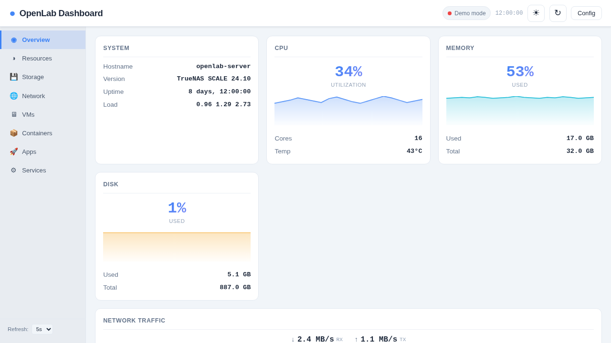
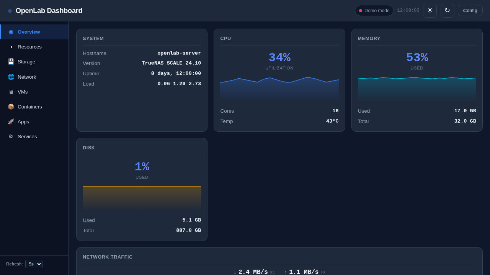

# OpenLab Dashboard

A self-hosted, single-page monitoring dashboard for homelab infrastructure. Connects to **Netdata**, **TrueNAS**, and **ntopng** — or runs in demo mode with no backend required.


## Features

- **Zero dependencies** — pure HTML/CSS/JS, no build step, no npm
- **Dark & light theme** with toggle
- **Auto-refresh** (5s / 10s / 30s / 60s / off)
- **Config modal** — enter your Netdata/TrueNAS/ntopng URLs, click Save, done
- **Service detection** — auto-detects which backends are reachable
- **Demo mode** — works out of the box with simulated data, no setup needed
- **Responsive** — works on desktop and mobile

## Screenshots

| Light Mode | Dark Mode |
|---|---|
|  |  |

## Quick Start

```bash
# Option 1: Python (any machine with Python 3)
python3 -m http.server 8000
# Open http://localhost:8000

# Option 2: Docker
docker run -d --name openlab-dashboard -p 8000:8000 \
  -v /path/to/openlab-dashboard:/usr/share/nginx/html:ro \
  nginx:alpine

# Option 3: Copy to any web server (Apache, Nginx, Caddy, etc.)
```

## Configuration

Click the **Config** button (gear icon) in the top-right corner and fill in:

| Field | Description | Required |
|---|---|---|
| **Netdata URL** | e.g. `http://localhost:19999` or `http://192.168.1.50:19999` | Recommended |
| **ntopng URL** | e.g. `http://localhost:3000` | Optional |
| **TrueNAS URL** | e.g. `https://truenas.local` | Optional |
| **Username** | TrueNAS username | If using TrueNAS |
| **API Key** | TrueNAS API key (not password) | If using TrueNAS |

All settings are saved to `localStorage` — no server-side storage needed.

### Netdata (recommended)

The dashboard fetches real-time data from Netdata's REST API:
- CPU utilization + history chart
- Memory usage + history chart
- Network traffic (RX/TX) + history chart
- Disk space

Just point it at your Netdata instance and you get live data immediately.

### TrueNAS (optional)

Adds system info (hostname, version, uptime), storage pool usage, VM list, and service status from the TrueNAS REST API v2.0.

**Tip:** Use an API key instead of your password. Generate one in the TrueNAS Web UI under **Credentials → API Keys**.

### ntopng (optional)

If you have ntopng running, you can embed its traffic analysis interface via iframe in the Network section.

## Sections

| Section | Data Source | Shows |
|---|---|---|
| **Overview** | Netdata / TrueNAS | CPU, memory, disk, network at a glance |
| **Resources** | Netdata | CPU & memory history charts (60s rolling) |
| **Storage** | TrueNAS | Pool usage with progress bars |
| **Network** | Netdata | Traffic history, interface stats |
| **VMs** | TrueNAS | Name, state, vCPUs, memory |
| **Containers** | Docker API | Name, image, status, ports |
| **Apps** | TrueNAS | Installed applications |
| **Services** | TrueNAS | Service name, state, PID, enabled |

## Browser Compatibility

- Chrome / Edge / Firefox / Safari (latest)
- Mobile browsers (iOS Safari, Android Chrome)
- Not tested on IE11 (intentionally)

## Project Structure

```
openlab-dashboard/
├── index.html          # Main page
├── css/
│   └── styles.css      # Dark + light theme
├── js/
│   └── dashboard.js    # All logic (Netdata, TrueNAS, rendering)
├── assets/             # Screenshots for README
├── config.example.json # Example configuration
├── LICENSE             # MIT
└── README.md           # This file
```

## Contributing

1. Fork the repository
2. Create a feature branch (`git checkout -b feature/amazing-feature`)
3. Commit your changes (`git commit -m 'Add amazing feature'`)
4. Push to the branch (`git push origin feature/amazing-feature`)
5. Open a Pull Request

## License

MIT License — see [LICENSE](LICENSE) for details.

## Acknowledgments

- [Netdata](https://github.com/netdata/netdata) — real-time monitoring
- [TrueNAS](https://www.truenas.com/) — storage platform
- [ntopng](https://www.ntop.org/products/traffic-analysis/ntop/) — network analysis
- Built by an AI agent (OWL) on a TrueNAS homelab, June 2026
